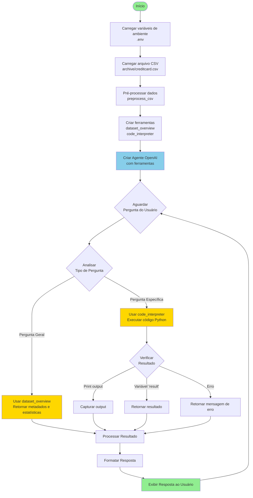
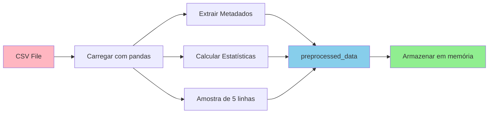
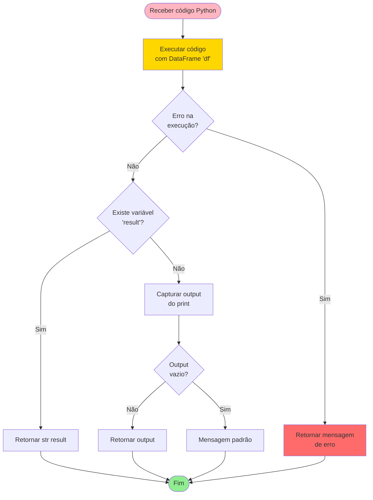

# 📊 Fluxograma do Agente Analista de Dados

Este documento descreve o fluxo de funcionamento do agente de análise de dados.

## 🔄 Fluxo Principal

## 🔧 Fluxo de Pré-processamento

## 🛠️ Fluxo da Ferramenta code_interpreter

## 📝 Descrição dos Componentes

### 1. Inicialização
- **Carregamento de ambiente**: Lê a variável `OPENAI_API_KEY` do arquivo `.env`
- **Carregamento de dados**: Lê o arquivo CSV e armazena em `df_global`
- **Pré-processamento**: Gera metadados, estatísticas e amostra dos dados

### 2. Criação do Agente
- **Modelo**: OpenAI GPT-4o
- **Ferramentas**: 
  - `dataset_overview`: Para perguntas gerais
  - `code_interpreter`: Para cálculos específicos
- **Configuração**: `num_history_runs=1` para limitar histórico

### 3. Processamento de Perguntas
- **Análise**: O agente decide qual ferramenta usar baseado na pergunta
- **Execução**: Chama a ferramenta apropriada
- **Resposta**: Formata e retorna o resultado ao usuário

### 4. Tipos de Perguntas

#### Perguntas Gerais → `dataset_overview`
- "Quantas colunas há no dataset?"
- "Quais colunas possuem valores ausentes?"
- "Quais são os tipos de dados?"

#### Perguntas Específicas → `code_interpreter`
- "Qual a média da coluna 'Amount'?"
- "Filtre as transações fraudulentas"
- "Crie um gráfico de barras"

## 🔄 Loop de Interação

O agente funciona em um loop contínuo:
1. Recebe pergunta do usuário
2. Analisa e escolhe ferramenta
3. Executa e processa resultado
4. Retorna resposta formatada
5. Aguarda próxima pergunta

