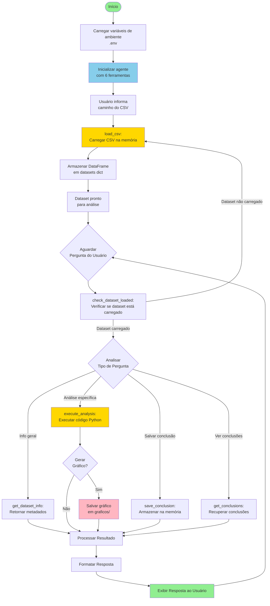
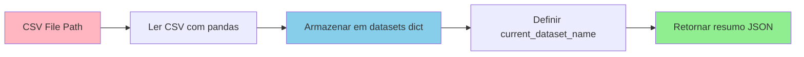
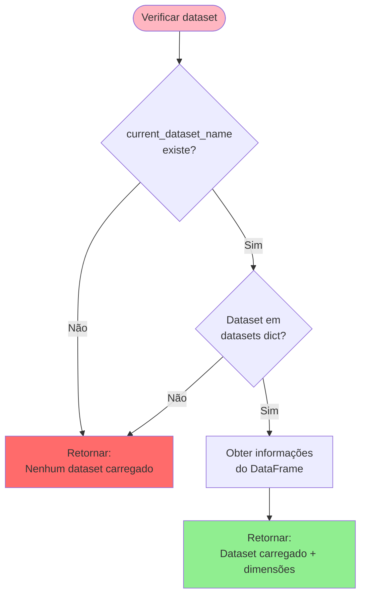
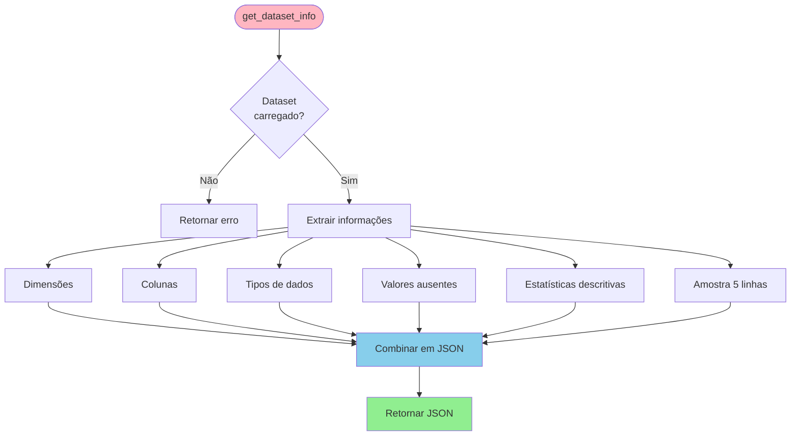
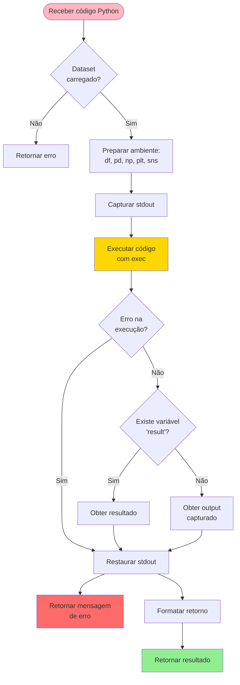
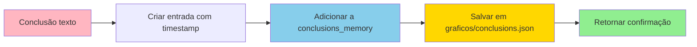
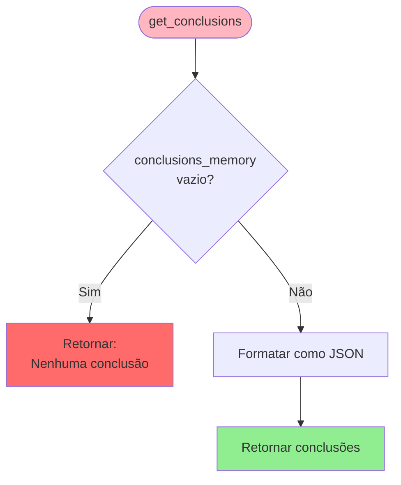
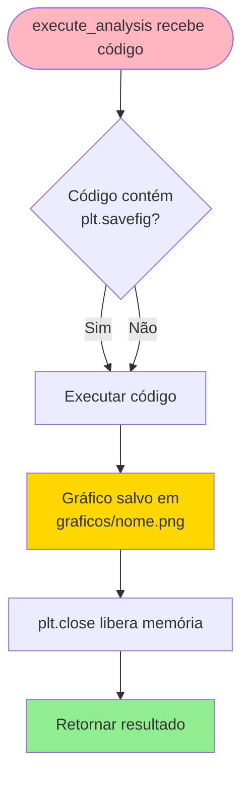
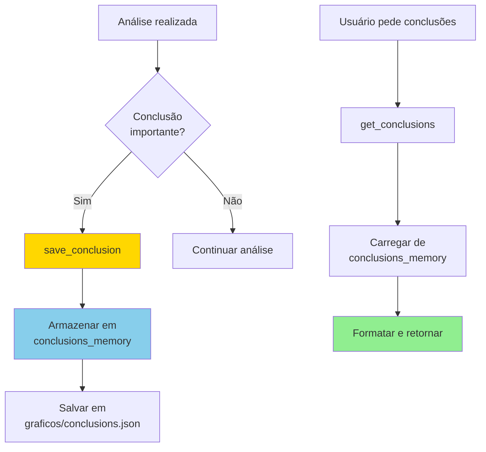
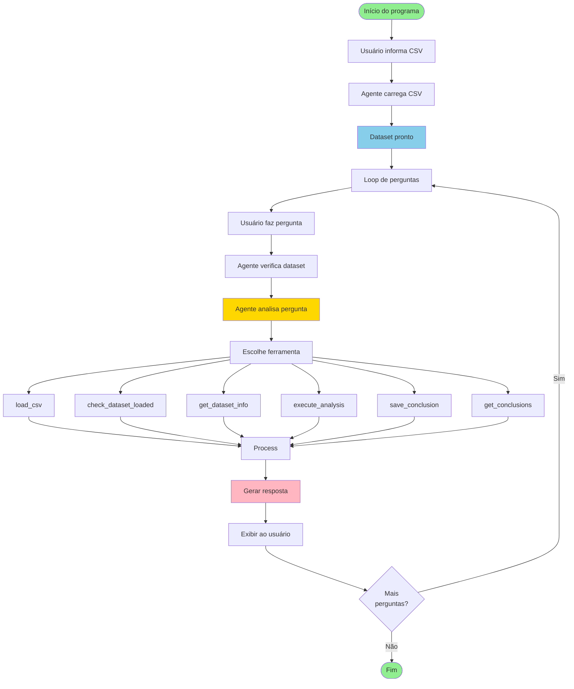

# 📊 Fluxograma do Agente Genérico de EDA

Este documento descreve o fluxo de funcionamento do agente genérico de análise exploratória de dados (EDA).

## 🔄 Fluxo Principal



## 🛠️ Ferramentas Disponíveis

### 1. `load_csv`
Carrega um arquivo CSV e o armazena na memória global.



### 2. `check_dataset_loaded`
Verifica se há um dataset carregado na memória.



### 3. `get_dataset_info`
Retorna informações completas sobre o dataset carregado.



### 4. `execute_analysis`
Executa código Python para análises específicas e geração de gráficos.



### 5. `save_conclusion`
Salva uma conclusão importante na memória.



### 6. `get_conclusions`
Recupera todas as conclusões salvas.



## 📊 Fluxo de Geração de Gráficos



## 🔄 Fluxo de Memória de Conclusões



## 🎯 Tipos de Análises Suportadas

### A) Descrição dos Dados
- Tipos de dados (numéricos, categóricos)
- Distribuições (histogramas, boxplots)
- Intervalos (mínimo, máximo, quartis)
- Medidas de tendência central (média, mediana, moda)
- Variabilidade (desvio padrão, variância, IQR)

### B) Identificação de Padrões e Tendências
- Padrões temporais
- Valores mais/menos frequentes
- Agrupamentos ou clusters visuais

### C) Detecção de Anomalias (Outliers)
- Identificação usando IQR, Z-score
- Análise de impacto
- Sugestões de tratamento

### D) Relações entre Variáveis
- Gráficos de dispersão
- Matriz de correlação
- Tabelas cruzadas
- Identificação de correlações

### E) Conclusões e Insights
- Resumo das descobertas
- Insights baseados nas análises
- Recomendações

## 🔄 Loop de Interação Completo



## 📝 Descrição dos Componentes

### 1. Inicialização
- **Carregamento de ambiente**: Lê `OPENAI_API_KEY` do arquivo `.env`
- **Configuração de gráficos**: Define estilo seaborn e parâmetros matplotlib
- **Variáveis globais**: 
  - `datasets`: Dicionário para armazenar DataFrames
  - `current_dataset_name`: Nome do dataset atual
  - `conclusions_memory`: Lista de conclusões salvas

### 2. Criação do Agente
- **Modelo**: OpenAI GPT-4o
- **Ferramentas**: 6 ferramentas especializadas
- **Instruções**: Processo de trabalho detalhado e diretrizes específicas

### 3. Processamento de Perguntas
- **Verificação**: Sempre verifica se dataset está carregado
- **Análise**: O agente decide qual ferramenta usar
- **Execução**: Executa código Python quando necessário
- **Geração de gráficos**: Salva automaticamente em `graficos/`
- **Memória**: Salva conclusões importantes

### 4. Sistema de Memória
- **Conclusões**: Armazenadas em memória e arquivo JSON
- **Persistência**: Conclusões sobrevivem entre sessões
- **Recuperação**: Pode recuperar todas as conclusões a qualquer momento

## 🔧 Estrutura de Dados

### datasets (dict)
```python
{
    "creditcard": DataFrame,  # Dataset carregado
    "outro_dataset": DataFrame # Outro dataset (se carregado)
}
```

### conclusions_memory (list)
```python
[
    {
        "timestamp": "2025-01-XX...",
        "conclusion": "Texto da conclusão"
    },
    ...
]
```

## 📂 Estrutura de Arquivos Gerados

```
graficos/
├── grafico1.png
├── grafico2.png
├── ...
└── conclusions.json
```

## 🔄 Fluxo de Execução Típico

1. **Inicialização**: Carrega variáveis de ambiente
2. **Carregamento**: Usuário informa CSV → agente carrega
3. **Análise**: Usuário faz pergunta → agente:
   - Verifica dataset carregado
   - Escolhe ferramenta apropriada
   - Executa análise
   - Gera gráficos (se necessário)
   - Salva conclusões (se relevante)
   - Retorna resposta
4. **Loop**: Repete passo 3 até usuário sair
5. **Finalização**: Conclusões permanecem salvas em JSON
